.. SphinxMenual Documentation master file.

#######################
Sphinx Basic Directions
#######################

1. Sphinx란
==========

`PEP 257 <https://www.python.org/dev/peps/pep-0257/>`_, Docstrong Conventions. 문서화에 아주 중요하게 쓰일 docstring 컨벤션에 대해 정의한 PEP 입니다.
Sphinx는 바로 Python 코드 내에 들어간 docstring을 자동으로 문서화해주는 도구이며 아주 간단한 설정만 끝내면 손쉽게 문서를 만들 수 있습니다.

2. 설치
=====

Anaconda2에 기본 내장 되어 있습니다.

3. 환경 설정
========

윈도우 환경 설정에 Path를 추가 합니다.
   [고급 시스템 설정] -> [고급] -> [환경 변수] -> [새로 만들기] -> [새 사용자 변수] 
   
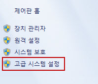

[고급 시스템 설정]
   
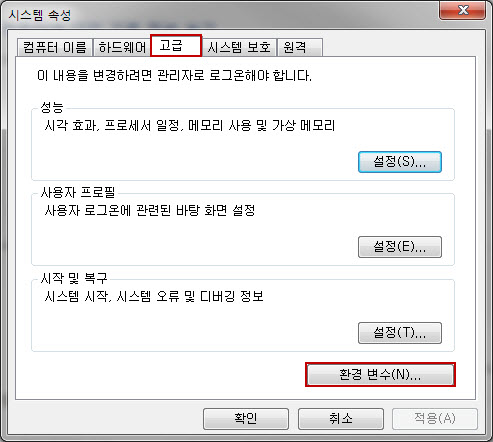

[고급] -> [환경 변수]
   
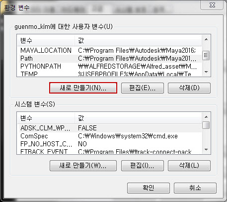

[새로 만들기]

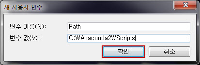

[새 사용자 변수] 

.. important::
   
   시스템 환경 변수는 본사에서 관리 하므로 추가 하지 않는다.
   
   변수 이름: Paht
   
   변수 값: Anaconda가 설치된 경로에 Script 폴더로 설정 한다. 

4. 프로젝트 폴더 구조
=============
프로 젝트 폴더 구조는 다음과 같이 만듭니다.

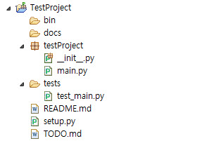

.. note:: 
   폴더 구조는 다음 싸이트를 참고 했습니다. 

   `link1`_, `link2`_, `link3`_

   .. _link1: http://python-guide-kr.readthedocs.io/ko/latest/writing/structure.html
   
   .. _link2: http://stackoverflow.com/questions/193161/what-is-the-best-project-structure-for-a-python-application
   
   .. _link3: https://learnpythonthehardway.org/book/ex46.html

5. sphinx-quickstart
====================

cmd 창에서 docs 폴더로 이동 합니다.

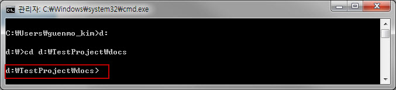

cmd 창에서 sphinx-quickstart를 입력하고 다음과 같이 진행합니다.

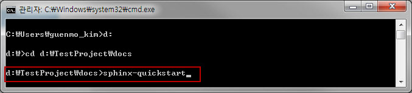

.. code-block:: restructuredtext
   :emphasize-lines: 20,21,28,53,55,56,61 

   Welcome to the Sphinx 1.4.8 quickstart utility.   
   
   Please enter values for the following settings (just press Enter to
   accept a default value, if one is given in brackets).
   
   Enter the root path for documentation.
   > Root path for the documentation [.]: 
   
   You have two options for placing the build directory for Sphinx output.
   Either, you use a directory "_build" within the root path, or you separate
   "source" and "build" directories within the root path.
   > Separate source and build directories (y/n) [n]:
   
   Inside the root directory, two more directories will be created; "_templates"
   for custom HTML templates and "_static" for custom stylesheets and other static 
   files. You can enter another prefix (such as ".") to replace the underscore.
   > Name prefix for templates and static dir [_]:
   
   The project name will occur in several places in the built documentation.
   > Project name: TestProject
   > Author name(s): GuenMo Kim
   
   Sphinx has the notion of a "version" and a "release" for the
   software. Each version can have multiple releases. For example, for
   Python the version is something like 2.5 or 3.0, while the release is
   something like 2.5.1 or 3.0a1. If you don't need this dual structure,
   just set both to the same value.
   > Project version: 1.0.0 
   > Project release [1.0]:
   
   If the documents are to be written in a language other than English,
   you can select a language here by its language code. Sphinx will then
   translate text that it generates into that language.
   
   For a list of supported codes, see
   http://sphinx-doc.org/config.html#confval-language.
   > Project language [en]:
   
   The file name suffix for source files. Commonly, this is either ".txt"
   or ".rst". Only files with this suffix are considered documents.
   > Source file suffix [.rst]:
   
   One document is special in that it is considered the top node of the
   "contents tree", that is, it is the root of the hierarchical structure
   of the documents. Normally, this is "index", but if your "index"
   document is a custom template, you can also set this to another filename.
   > Name of your master document (without suffix) [index]:
   
   Sphinx can also add configuration for epub output:
   > Do you want to use the epub builder (y/n) [n]:
   
   Please indicate if you want to use one of the following Sphinx extensions:
   > autodoc: automatically insert docstrings from modules (y/n) [n]: y
   > doctest: automatically test code snippets in doctest blocks (y/n) [n]:
   > intersphinx: link between Sphinx documentation of different projects (y/n) [n]: y
   > todo: write "todo" entries that can be shown or hidden on build (y/n) [n]: y
   > coverage: checks for documentation coverage (y/n) [n]:
   > pngmath: include math, rendered as PNG images (y/n) [n]:
   > mathjax: include math, rendered in the browser by MathJax (y/n) [n]:
   > ifconfig: conditional inclusion of content based on config values (y/n) [n]:
   > viewcode: include links to the source code of documented Python objects (y/n) [n]: y
   > githubpages: create .nojekyll file to publish the document on Github pases(y/n) [n]:
   
   A Makefile and a Windows command file can be generated for you so that you
   only have to run e.g. `make html' instead of invoking sphinx-build
   directly.
   > Create Makefile? (y/n) [y]:
   > Create Windows command file? (y/n) [y]:
   
   Creating file docs/conf.py.
   Creating file docs/index.rst.
   Creating file docs/Makefile.
   Creating file docs/make.bat.

   Finished: An initial directory structure has been created.

   You should now populate your master file docs/index.rst and create other documentation
   source files. Use the Makefile to build the docs, like so:
      make builder
   where "builder" is one of the supported builders, e.g. html, latex or linkcheck.

docs 폴더 안에 다음 구조가 생깁니다.

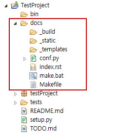

cmd 창에서 make html를 입력하고 다음과 같이 진행합니다.

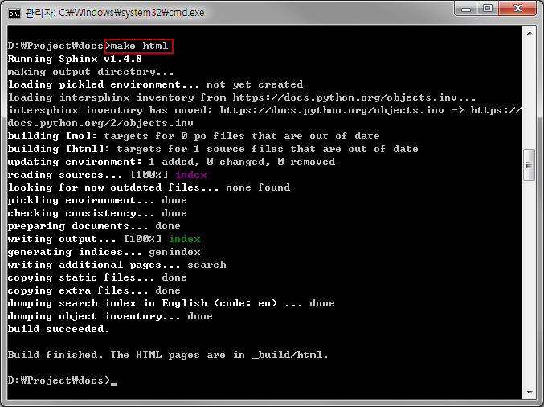

_build/html 폴더 안에 다음 구조가 생깁니다.

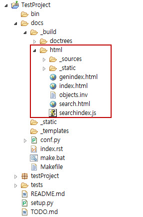

_build/html/index.html을 확인 해보면 다음과 같습니다.

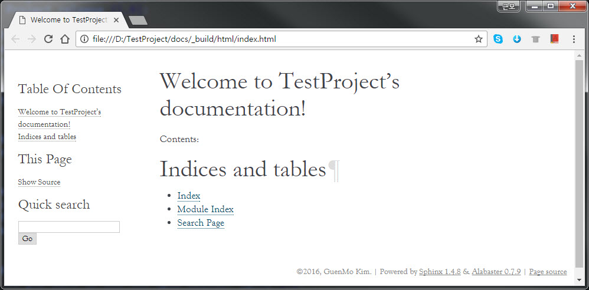

6. Theme 변경
===========

Sphinx로 만들어지는 html의 테마를 병경 해보겠습니다.

다음 링크로 이동 하고 다운로드 합니다.

Read The Docs Theme : https://github.com/snide/sphinx_rtd_theme

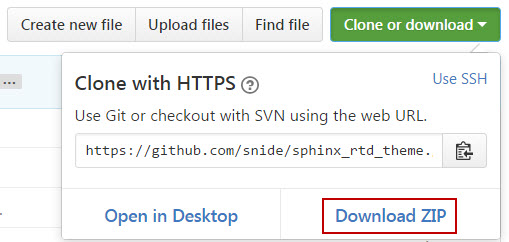

앞축을 풀고 sphinx_rtd_theme-master/sphinx_rtd_theme-master/ 안에 sphinx_rtd_theme 폴더를 복사 하고

docs/_theme 폴더를 만들어 붙여넣기를 합니다.

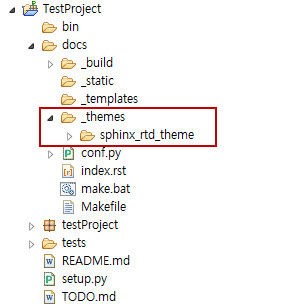

docs/conf.py를 수정 합니다.

.. code-block:: restructuredtext

   html_theme = 'sphinx_rtd_theme'
   
   html_theme_options = {
       'collapse_navigation': False,
       'display_version': False,
       'navigation_depth': 3,
   }
   
   html_theme_path =  ["_themes", ]

cmd 창에서 make html을 다시 실행 합니다.

_build/html/index.html을 다시 확인 해보면 테마가 변경된 것을 볼수 있습니다.

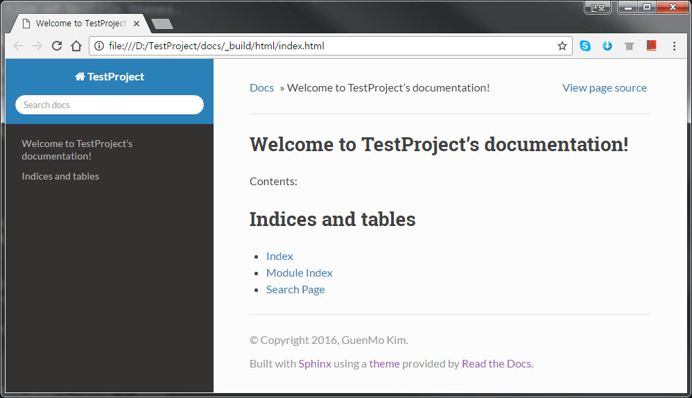

7. sphinx-apidoc
================

apidoc은 프로젝트에 포함한 pacakge, module, class, fuction, value들에 포함된 주석들을 자동으로 문서화 해주는 기능 입니다.

우선 docs/conf.py를 수정 합니다.

주석 처리된 부분을 찾아서 아래와 같이 수정 합니다.

.. code-block:: restructuredtext
   :emphasize-lines: 20,21,28,53,55,56,61 

   # import os
   # import sys
   # sys.path.insert(0, os.path.abspath('.'))

   # source_encoding = 'utf-8-sig'
   
   
   import os
   import sys
   sys.path.insert(0, os.path.abspath('..')) # 프로젝트 package path 설정
   
   source_encoding = 'cp949' # 한글 출력
   
project/main.py에 함수를 추가 합니다.

.. code-block:: restructuredtext

   # coding:utf-8
   
   def testFunc(arg1, arg2):
       """이 함수는 두개의 변수를 받아 그 값을 더해 리턴 합니다.
    
       :param arg1: 첫 번째 변수 입니다.
       :type arg1: (int)
       :param arg2: 두 번째 변수 입니다.
       :type arg1: (float)
       
       :returns: arg1 + arg2
       :rtype: (float) 
       
       :Example:
       
       >>> print testFunc(1 , 0.5)
       1.5
           
       """
       
       return arg1 + arg2

cmd 창에 다음과 같이 입력하고 실행 합니다.

.. code-block:: restructuredtext

   sphinx-apidoc -F -o <docs의 경로> <프로젝트의 package 경로> --separate
   
   ex)
   sphinx-apidoc -F -o D:\TestProject\docs D:\TestProject\testProject\ --separate

아래와 같이 결과가 출력 됩니다. 위에 두 줄을 보면 testProject.rst와 testProject.main.rst 추가 적으로 두개의 파일이 생성 됩니다.
  
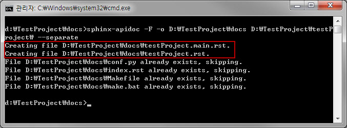

cmd 창에 make html을 실행 하고 _build\html\index.html을 확인한다.
   [Module Index] -> [testProject.main] 클릭 합니다.
      주석이 자동으로 문서화 되었습니다.

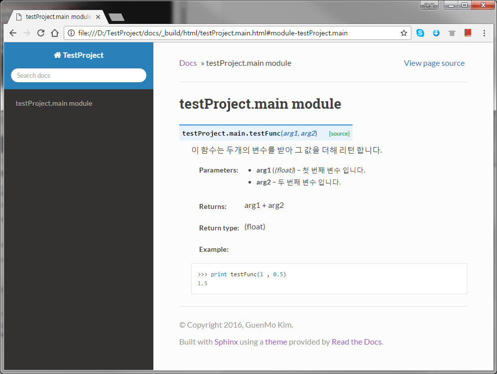

8. Mock Class
=============

project/fucntionForMaya.py 추가 합니다.

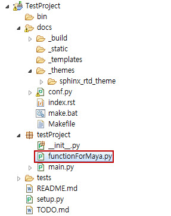

함수를 다음과 같이 추가 합니다.
   
.. code-block:: restructuredtext
   
   # coding:utf-8
   
   import pymel.all as pm
   
   def makeCube():
       """ 폴리곤 큐브를 만들고 이름을 리턴 합니다.
       
       :returns: 폴리곤 큐브 이름
       :rtype: (str)
        
       """
       cube = pm.polyCube()
       
       return cube.name()

cmd 창에 다음과 같이 입력하고 실행 합니다.

.. code-block:: restructuredtext

   sphinx-apidoc -F -o D:\TestProject\docs D:\TestProject\testProject\ --separate

새로 fucntionForMaya.rst 파일이 생성 되었습니다.

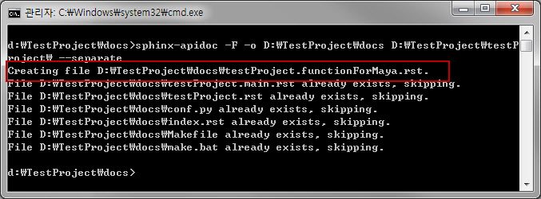

cmd 창에 make html 실행해 보면 :file:`ImportError: No module named pymel.all` 라는 에러가 발생 하면서 문서화가 실패 합니다.

Anaconda2 python에서 pymel 당연히 모듈을 찾을수 없기 때문입니다.

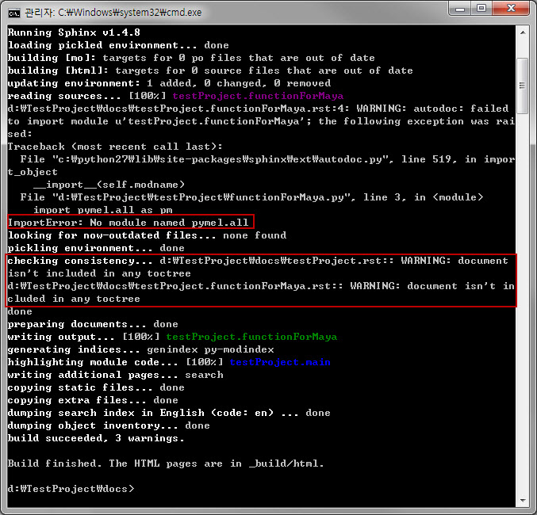

conf.py 파일에 다음 코드를 추가 한다.

.. code-block:: restructuredtext
   :emphasize-lines: 6-34
   
   import os
   import sys
   sys.path.insert(0, os.path.abspath('..'))
   # 다음 줄에 아래 코드를 추가 한다.
   
   class Mock(object):
   
       __all__ = []
   
       def __init__(self, *args, **kwargs):
           pass
   
       def __call__(self, *args, **kwargs):
           return Mock()
   
       @classmethod
       def __getattr__(cls, name):
           if name in ('__file__', '__path__'):
               return '/dev/null'
           elif name[0] == name[0].upper():
               mockType = type(name, (), {})
               mockType.__module__ = __name__
               return mockType
           else:
               return Mock()
   
   MOCK_MODULES = ['maya', 'maya.cmds', 'maya.mel', 
                   'maya.OpenMaya', 'maya.OpenMayaUI',
                   'maya.api.OpenMaya', 'maya.api.OpenMayaUI',
                   'pymel', 'pymel.core', 'pymel.all']
   
   for mod_name in MOCK_MODULES:
       sys.modules[mod_name] = Mock()

cmd 창에 make html 실행 한후 새로운 만든 함수의 주석이 문서화 되었는지 확인 합니다.

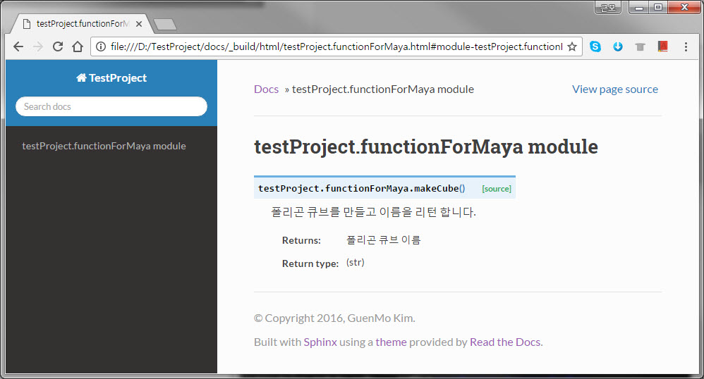

9. 참고 자료
========

reStructuredText
----------------

http://www.sphinx-doc.org/en/1.4.8/rest.html

http://docutils.sourceforge.net/docs/user/rst/quickref.html#third

http://thomas-cokelaer.info/tutorials/sphinx/rest_syntax.html

Python Docstring
----------------

http://sphinxcontrib-napoleon.readthedocs.io/en/latest/example_google.html

http://sphinxcontrib-napoleon.readthedocs.io/en/latest/example_numpy.html

http://thomas-cokelaer.info/tutorials/sphinx/docstring_python.html

.. toctree::
   :maxdepth: 1
   
